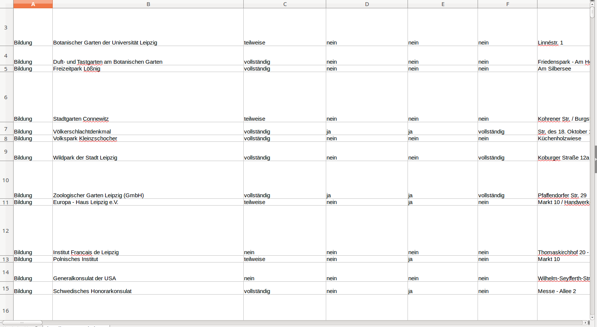

# Data

This folder contains all data related files. They will be used for processing and evaluation issues.

## place-data-from-bvl.csv

This files is from the Github repository [transform-bvl-pages-to-csv-file](https://github.com/AKSW/transform-bvl-pages-to-csv-file) and contains an enriched version of the place database, maintained by the [Behindertenverband Leipzig e.V.](http://www.le-online.de/).

File is licensed under [Data licence Germany – attribution – version 2.0](https://www.govdata.de/dl-de/by-2-0)

